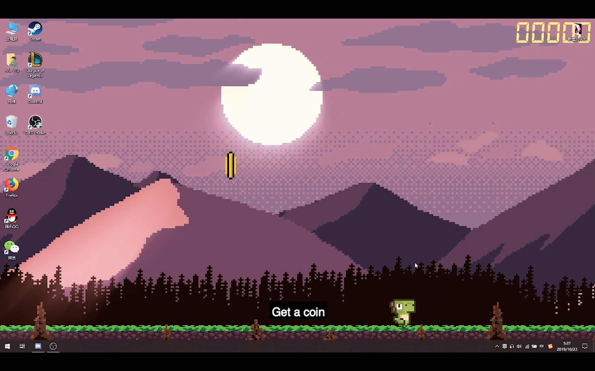
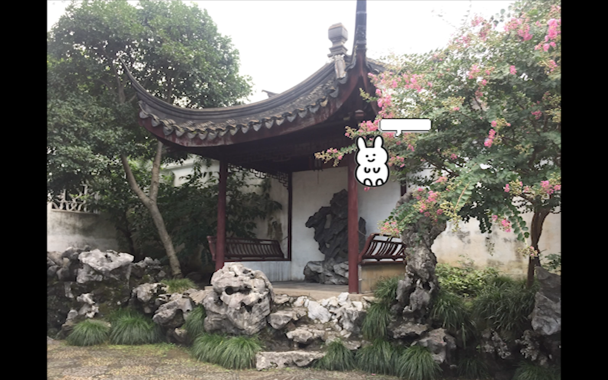
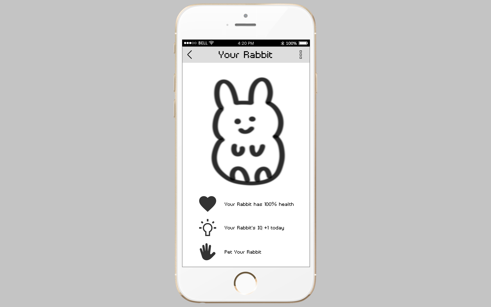

# 7 in 7

## 01

### [Video](https://drive.google.com/file/d/1rKQKy1DiGFQWN2tQ-YWEYdA5-lOqW-Rk/view?usp=sharing)

This prototype is inspired by how Siri and Cortana work on your device that you have to give the right commands to make them work. The user will be required to talk to the computer by using the Suzhou dialect to give commands, otherwise, the computer will not work as the user want. As you can see, I'm giving the command to ask the computer to get a coin in Mandarin, but the computer does not respond to me. The goal of this prototype is to force the users to use the Suzhou dialect during the usage of the computer.

## 02

### [Video](https://drive.google.com/file/d/1pglIKgBlMjB7CPqzoP2V2E62tjoif-hK/view?usp=sharing)

This is a question and answer battle game of the history and culture of Suzhou. You can beat the enemy's character by answering the questions correctly. Each character has 3 lives. Every time you did not give the answer correctly, you will lose one life. The one who has no life will lose the game. You can not only play with the bot controlled by the computer, but can play online with other players as well. 

## 03

### [Video](https://drive.google.com/file/d/1MKx2FiSsQIjK8dyeM-34VzVVqHeOrk2U/view?usp=sharing)

I was inspired by the video furret walk around the world, so I did a furret walk around the Classical Gardens of Suzhou. I think this furret walk video is a kind of meme culture that is popular among children. Maybe I can replace the furret to other popular memes to attract children's attention to watch these promotion videos and make them interested in the history and culture of Suzhou.

## 04

### [Video](https://drive.google.com/file/d/1O5cwtNA93AHYvm1SnO5Re8HKtCF6tnnz/view?usp=sharing)

I'm thinking about making a pen in real world which can do the same thing as "select and translate" on the laptop. If you touch an object with this pen, it will tell you how to say this object in Suzhou dialect.

## 05

### [Video](https://drive.google.com/file/d/1I3RVpVQ-VHJR-zTTupqHVcItPLbXF5ME/view?usp=sharing)

This is an AR app that can tour you around the Classical Gardens of Suzhou. There is a character in the APP who can guide you to walk around in the classical gardens following a planned route. When you reach an important spot, this character will stop you there and introduce that place or object to you.

## 06

### [Video](https://drive.google.com/file/d/14VU8xsRgqptU7XJdKQ5us1n6ef4aF94W/view?usp=sharing)

This APP updates information about the history and culture of Suzhou every day. If you read the article on that day, your character will gain IQ to grow up. I'm also thinking about the game I did on the second day can be linked to this APP.

## 07

### [Video]()

This is a cooking game.
