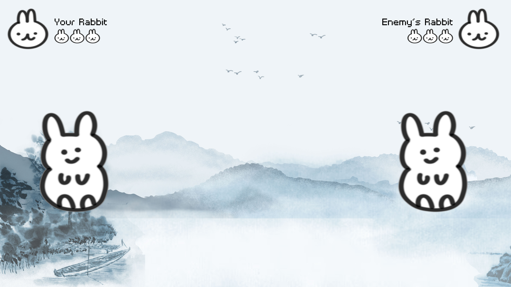

# 7 in 7

## 01

### [Video](https://drive.google.com/file/d/1rKQKy1DiGFQWN2tQ-YWEYdA5-lOqW-Rk/view?usp=sharing)

This prototype is inspired by how Siri and Cortana work on your device. The user will be required to talk to the computer by using the Suzhou dialect to give commands, otherwise, the computer will not work as the user want.

## 02

### [Video](https://drive.google.com/file/d/1pglIKgBlMjB7CPqzoP2V2E62tjoif-hK/view?usp=sharing)

This is a question and answer battle game of the history and culture of Suzhou. You can beat enemy's character by answering the questions correctly.

## 03

### [Video](https://drive.google.com/file/d/1MKx2FiSsQIjK8dyeM-34VzVVqHeOrk2U/view?usp=sharing)

I was inspired by the video furret walk around the world, so I did a furret walk around the Classical Gardens of Suzhou.
