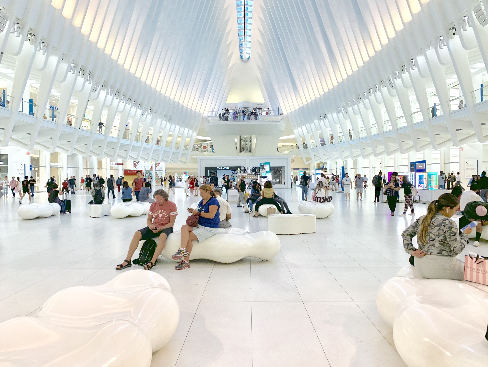
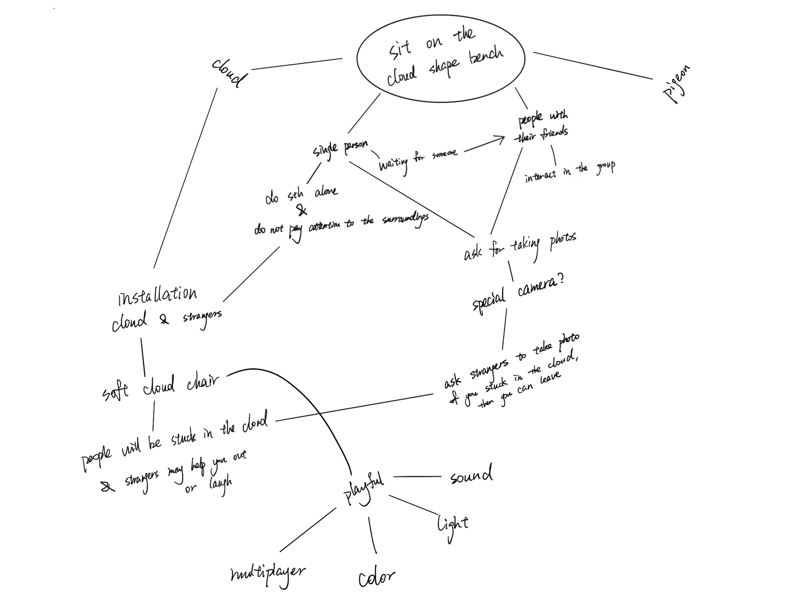

# Major Studio 1

## World Trade Center

### AEIOU Design Method

Since most of the people were justing walking through the square, we decided to focus on those poeple who used the cloud shape benches in the World Trade Center.

### Behavioral Mapping

### Brainstorming Tree

### Concept Sketch

