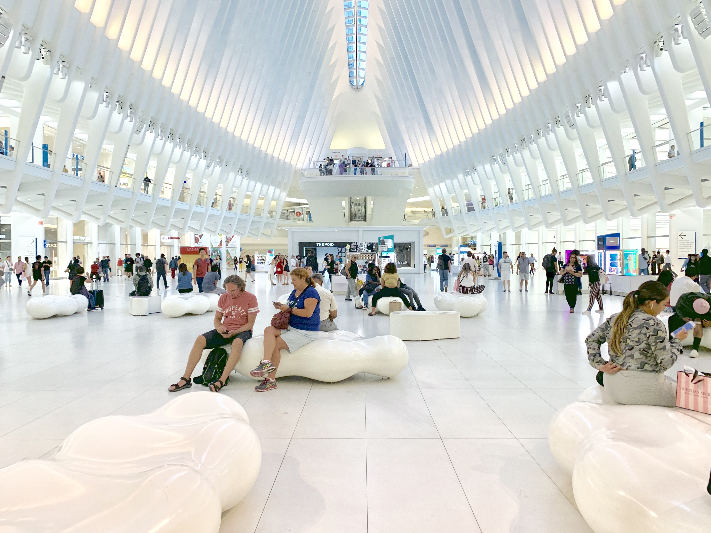
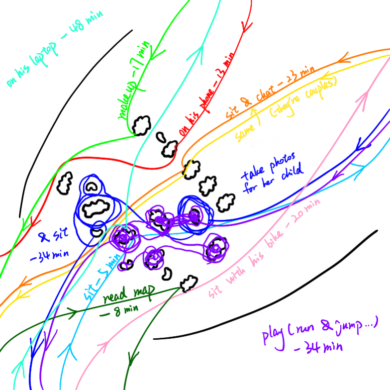
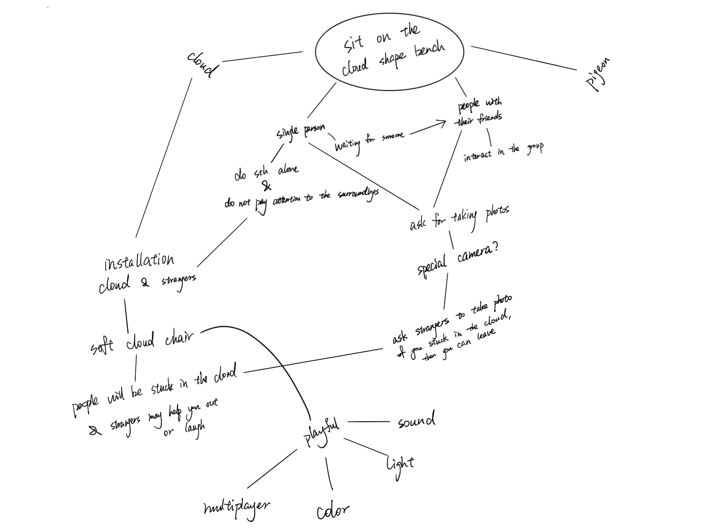
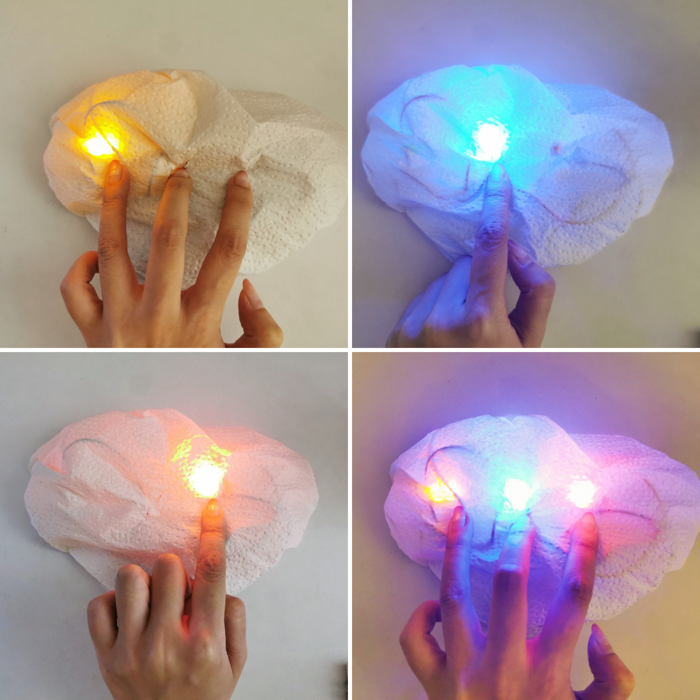
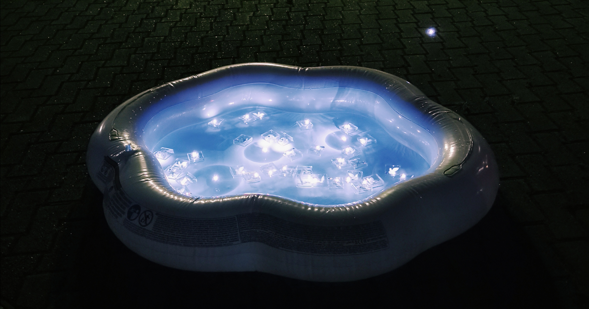
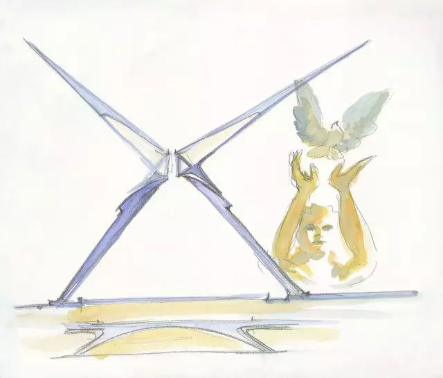
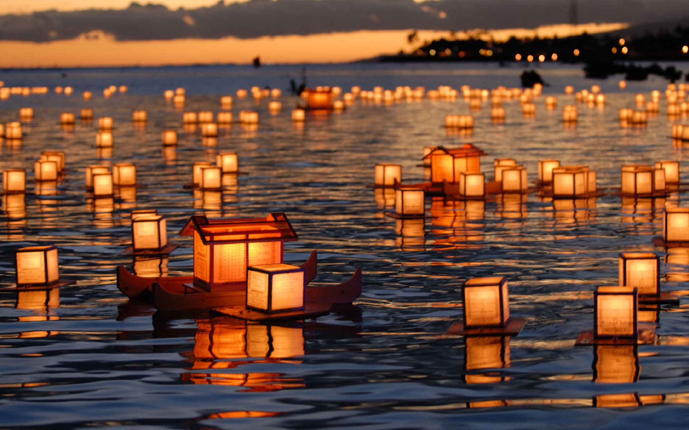
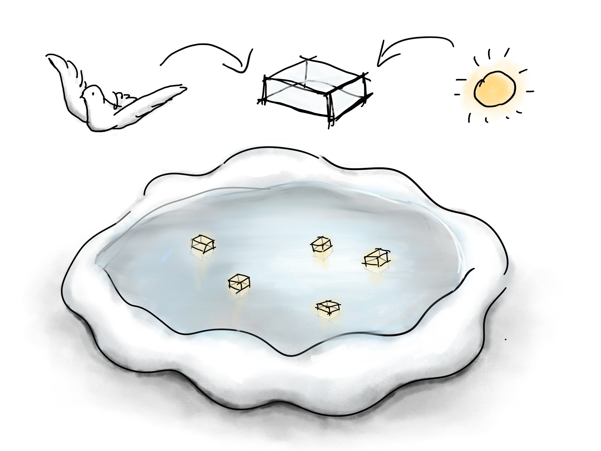
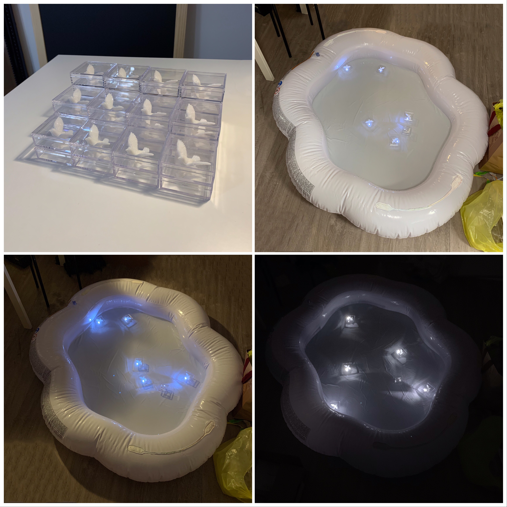
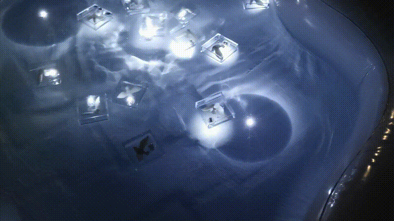

# Instruction Sets For Strangers

## World Trade Center

### AEIOU Design Method

Since most of the people were just walking through the square, we decided to focus on those poeple who used the cloud shape benches in the World Trade Center.

### Behavioral Mapping

### Brainstorming Tree

### Concept Sketch

The cloud is made of cotton and it has a speaker, lights, and sensors inside. If nobody sits on the cloud, it will be the same white color as the other cloud shape benches in the center. However, if there's anyone sits on it, it will produce sound and turn into yellow. If there's another person sit on it, the cloud will be divided into 2 parts with different colors of light. With the numbers of people sit on the cloud increase, the cloud will be colorful and produce more sound. Since this cloud is playful with multiplayer, we'd like to encourage people to invite not only their friends but also strangers to sit on this cloud with them to create a unique cloud with colors. It is a good chance for people to talk with strangers and take photos to record this moment.

----------------------------------------------------------------------

### Prototype I

----------------------------------------------------------------------

### Prototype II
Ver. 2.1

We used the curtain as the surface to test if the light of the LED strip could go through.

Ver. 2.2

However, after arriving at the spot and setting up the 1st version of our prototype, we found that people are not willing to sit on our work. We thought it might be the problem of the curtain. So we decided to stick the LED strip directly on the cloud shape bench to test if people are willing to sit and interact with it.

If there is nobody sitting on the cloud, the lights will blink to attract pedestrians.

When someone sits down, the lights are on.

### [On-site Testing](https://drive.google.com/file/d/1cl6HQE6kdBkBQQxDZ1znxLBi5kjeii0F/view?usp=sharing)

Users' Activities
- Sitting
- Taking photos
- Jumping up and down & crawling
- Chat with the maker

Feedback
- A visitor said it’s really cute!
- Changing of the status of lights could make the interaction longer.
- People are willing to sit down to make the lights always on.

Problems
- Technical Problem: Power supply.
- The time of people using the bench is not very long.

----------------------------------------------------------------------

### Final Prototype

Inspirations
- Peace dove

Dove is a symbol of peace. The designer of the station, Santiago Calatrava, was inspired by a picture of a child releasing a dove. That’s why we use dove as an element in our installation.

- The Ghost Festival

The Ghost Festival is a traditional Buddhist festival held in certain East Asian countries. On that day, people release paper boats and lanterns on water to give directions to the lost ghosts and spirits of the ancestors.

Sketch

We planned to use a cloud shape inflatable baby pool to match the other cloud shape benches in the Oculus, and we made a lot of transparent boxes with doves and LEDs in them. We decided to put a few of the boxes in the water to lead people to release other boxes in the water to create the feeling we want to convey.

Testing

----------------------------------------------------------------------

### Final Outcome

### [Video](https://drive.google.com/file/d/1ta1VIJ6kRS11R6sUyP324JcjOaYcs6iv/view?usp=sharing)

----------------------------------------------------------------------

### Reflection

We kind of completely changed our idea at the third week, which is the final week, so I think the final prototype will be much nicer if we stick on this final idea for the whole three week's process. When we did the on-site testing for the first and second prototype, there was nobody trying to prevent us from setting up in the Oculus. However, when we did the setup for the final prototype, the security did not allow us to set our project up not only inside the Oculus but also next to the 911 Memorial. This emergency disrupted us and our plan was in a mess. Although the prototype looked nice after a whole day's working, I still think that if we can ask the security before deciding to work with water inside the Oculus, the result will be better.
