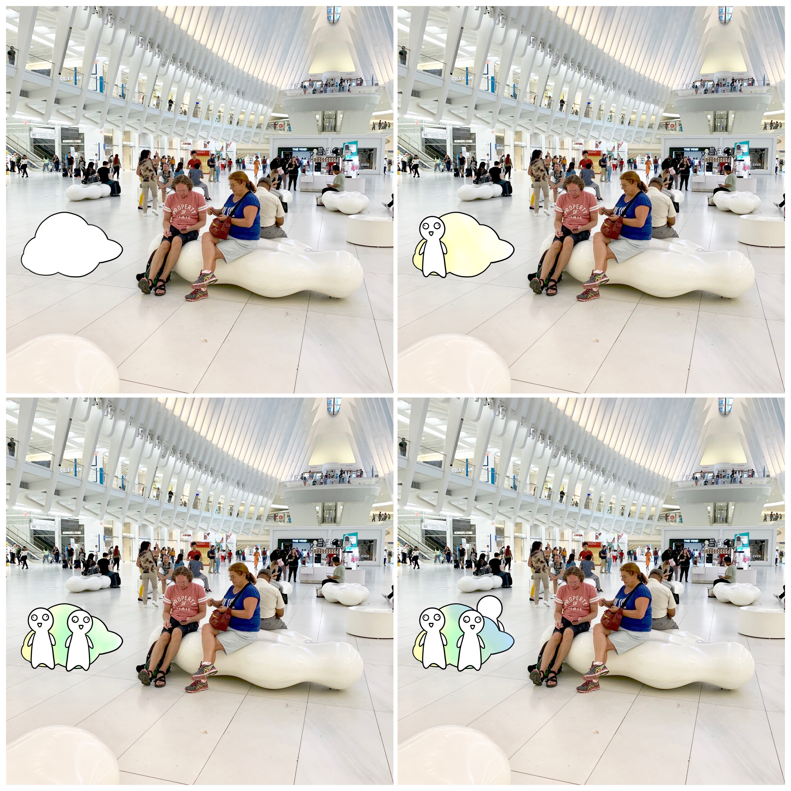

# Major Studio 1

## World Trade Center

### AEIOU Design Method

Since most of the people were just walking through the square, we decided to focus on those poeple who used the cloud shape benches in the World Trade Center.

### Behavioral Mapping

### Brainstorming Tree

### Concept Sketch

The cloud is made of cotton and it has a speaker, lights, and sensors inside. If nobody sits on the cloud, it will be the same white color as the other cloud shape benches in the center. However, if there's anyone sits on it, it will produce sound and turn into yellow. If there's another person sit on it, the cloud will be divided into 2 parts with different colors of light. With the numbers of people sit on the cloud increase, the cloud will be colorful and produce more sound. Since this cloud is playful with multiplayer, we'd like to encourage people to invite not only their friends but also strangers to sit on this cloud with them to create a unique cloud with colors. It is a good chance for people to talk with strangers and take photos to record this moment.

### Prototype I

### Prototype II
Ver. 2.1

We used the curtain as the surface to test if the light of the LED strip could go through.

Ver. 2.2

However, after arriving at the spot and setting up the 1st version of our prototype, we found that people are not willing to sit on our work. We thought it might be the problem of the curtain. So we decided to stick the LED strip directly on the cloud shape bench to test if people are willing to sit and interact with it.

If there is nobody sitting on the cloud, the lights will blink to attract pedestrians.

When someone sits down, the lights are on.

### On-site Testing

