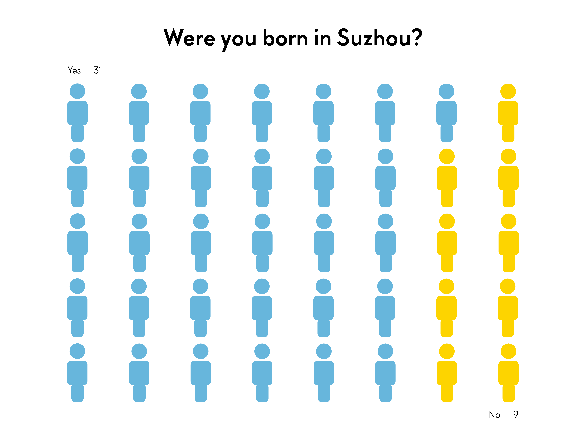
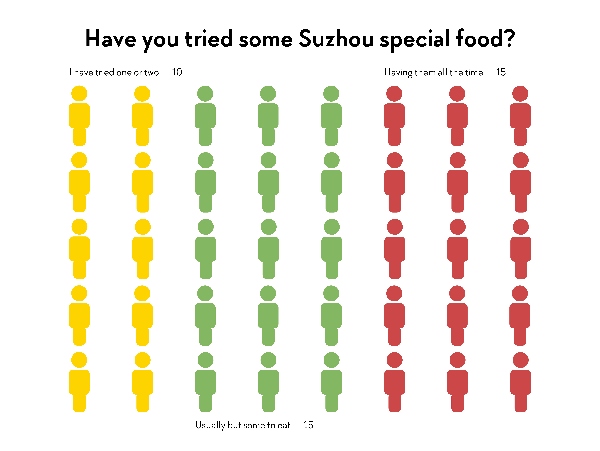
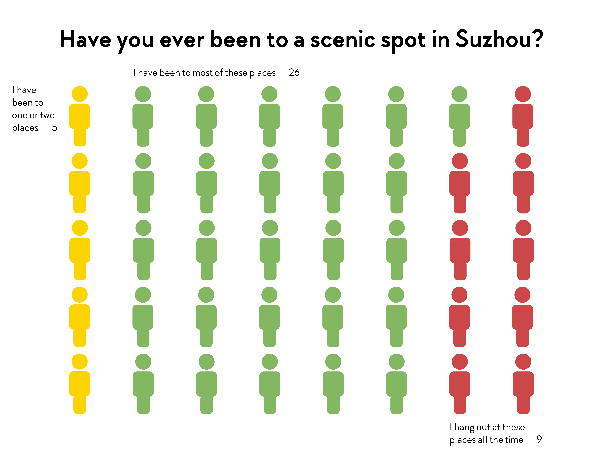
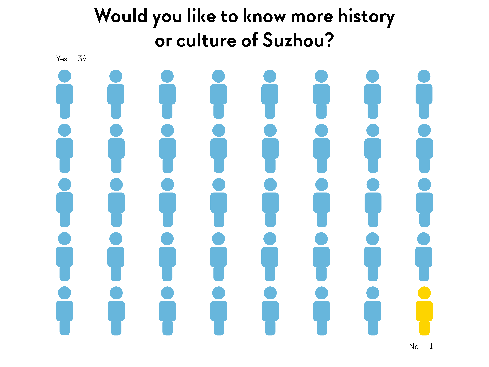

# Me, My Data

I did a survey of 40 children of different ages in the same class. The youngest of them was born in 2017 and the oldest one was born in 2005. Almost all of them are about at the elementary school's ages.

In the survey, I asked questions to test how much did children know about the history and culture of Suzhou.

