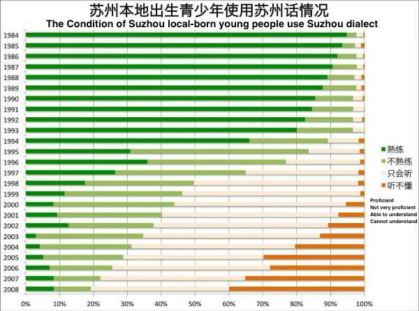

# Post Midterm Personal Reflection

I’d like to provide a little bit more context based on my presentation since Anna mentioned about thinking about the reason for the disappearance of Suzhou dialect in the critique. I mentioned there is an immigrant problem that caused the loss of Suzhou dialect in the presentation, and the data I found proved this problem. “With a resident population of 10.61 million, Suzhou is the only city in Jiangsu with a permanent population of over 10 million. By the end of 2015, the registered population of Suzhou was 6.67 million, that is, nearly 4 million people were migrants.” (April 28, 2016) Also, Suzhou has a non-resident population of one or two million people. This means that the Suzhou registered population and the migrant population (including non-residents) are originally half-to-half. What’s more, the Suzhou registered population does not mean those people living in Suzhou, the Suzhou registered population also includes millions of people who have settled in Suzhou but from other places. The children of those people definitely don’t speak Suzhou dialect — because they don’t speak Suzhou dialect at home at all.

I also did the research of why Suzhou native-born teenagers do not speak Suzhou dialect, and I found this graph of the condition of Suzhou local-born young people use Suzhou dialect.

From the chart, it is easy to notice that the proportion of children born after 1993 of speaking Suzhou dialect begins to plummet. First, a lot of people mentioned about the changes of the population structure, which is the same as I talked about. (Suzhou is an immigrant city with a resident population of 10.5 million. The total population is generally considered to be around 13 million, while the registered population is only 6 million, and at least one million of this 6 million people has moved to Suzhou in the past 20 years. Therefore, among all the population of Suzhou, the majority are from other places.) When most of the population must use Mandarin to communicate with each other, Mandarin becomes the mainstream instead of Suzhou dialect. Second, the particularity of Suzhou dialect structure also caused this problem. Except for the East and West Mountain areas in Suzhou, Suzhou dialect has a large difference among different places. There are almost a few different factions in each county. Wujiang (one of five urban districts in Suzhou) has different dialects in almost every town. People from south of Changshu (a county-level city under the jurisdiction of Suzhou) speak dialect from the city part of Suzhou (苏州城区话). People from east of Zhangjiagang (a county-level city under the administration of Suzhou) speak Suzhou dialects with Changshu accents, while people from the west speak Suzhou dialects with Jiangyin accents. And people from east of Kunshan (a county-level city with Shanghai on its eastern border and Suzhou on its western boundary) speak more like a Shanghai dialect. So there are confusions about what is the real Suzhou dialect. Third, there are changes in family structures. It is reasonable for children to speak Mandarin at school and speak Suzhou dialect at home. In fact, this does not work. Most of the marriages in the 1980s were within the scope of the town, and the communications among the couples and the elder people were all in dialects. However, since the mid-to-late 1990s, cross-provincial and cross-city marriages occupied a large proportion. On the contrary, marriages in the same town became less and less. Local people marry with foreigners, the language uses in the family is undoubtedly Mandarin. Also, considering about the particularity of Suzhou dialect structure, it is difficult for those people who have cross-town marriages to use their own dialects. So Mandarin becomes mainstream again. Finally, the changes of social economy also caused the problem. There are too many local residents in Suzhou decide to live cross-area / cross-town. If you buy a house and settle in a place 30 kilometers away, you will find that 50% of the surrounding people is a foreigner, and 30% of them are people with different accents. So it is really difficult to meet those people who have the same accent with you. Also, there are more and more teachers from other areas in the local elementary and secondary schools; the number of primary school enrollees is higher than that of locals. The number of foreign students enrolled in elementary schools also exceeds the number of locals. Since children are more likely to communicate with their classmates at school, there is not enough Suzhou dialect interaction. Even the family members are using Suzhou dialect at home, children still lack practice, which leads children to only understand Suzhou dialect and cannot speak Suzhou dialect.
